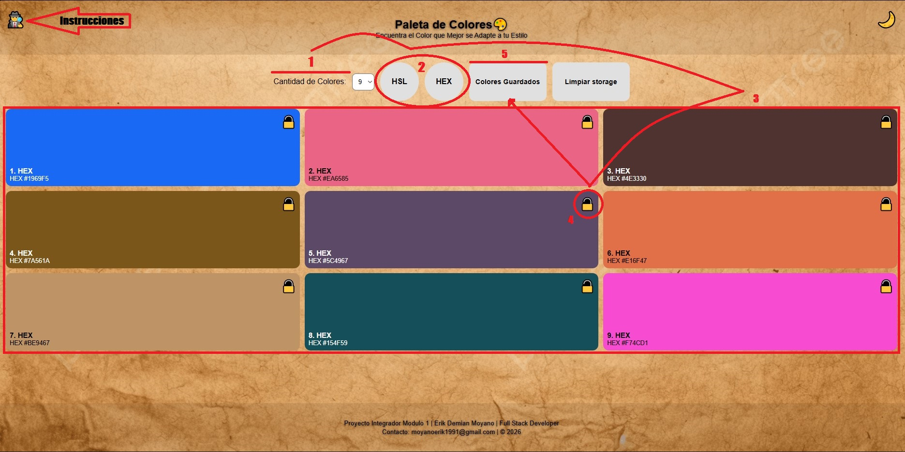
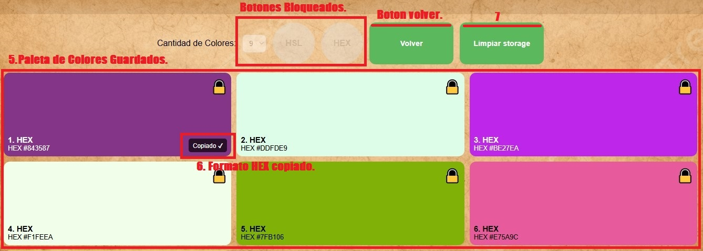
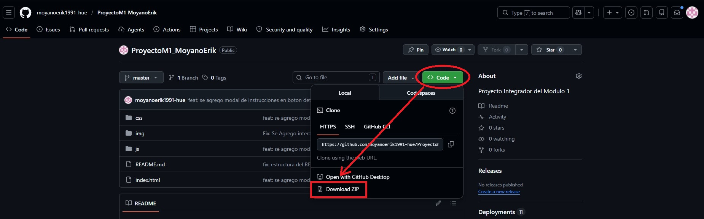
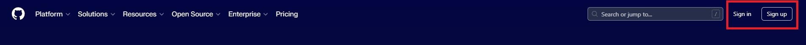
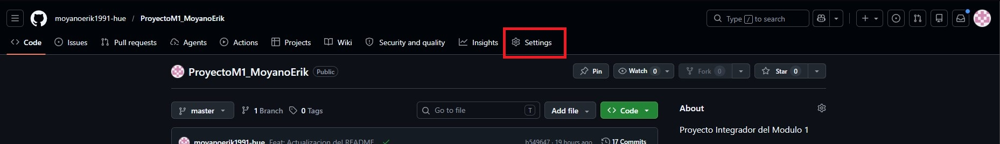
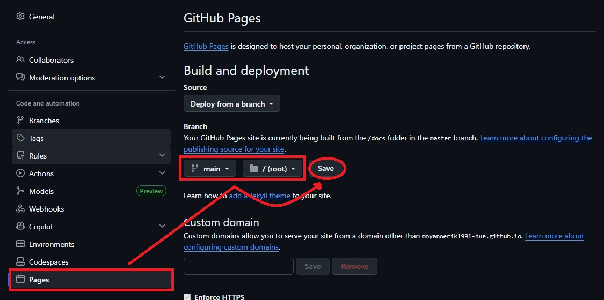
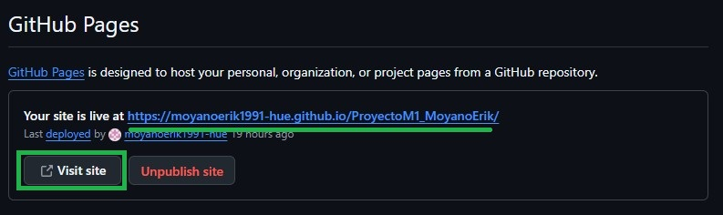

# Proyecto Integrador del Módulo 1

## 🙋‍♂️ Presentacion

**Soy Erik Moyano, estudiante de Full Stack Developer en la academia Soy-Henry.**

 - Estoy a cargo del desarrollo de una pagina web, que genera colores de manera aleatoria.

### ✨ Funcionalidades

- 🎲 Generación aleatoria de colores en formato **HEX** y **HSL**
- 🔒 Guardado de colores en LocalStorage
- 📋 Copia de código **HEX** al portapapeles con un click
- 🌙 Modo oscuro / claro
- 🕵️ Modal de instrucciones de uso
- 📱 Diseño responsive (móvil, tablet, escritorio)

---

### 🛠️ Tecnologías Utilizadas

| Tecnología | Uso |
|---|---|
| HTML5 | Estructura del proyecto |
| CSS3 | Estilos y responsive |
| JavaScript | Lógica y manipulación del DOM |
| LocalStorage | Persistencia de colores guardados |
| Git | Control Versiones |
| GitHub | Repositorio y presentación del proyecto |

### 📸 Instrucciones de Uso



 - **Paso 1:** Selecciona la cantidad de colores (6 - 8 - 9).
 - **Paso 2:** Click en botones HEX o HSL para iniciar búsqueda aleatoria.
 - **Consejo:** Utiliza el intercambio entre modo claro/oscuro para apreciar mejor los colores.
 - **Paso 3:** Visualizacion de Tarjeta de colores.
 - **Paso 4:** El candado 🔓 en las tarjetas permite guardar colores.
 - **Paso 5:** Es posible ver los colores guardados en cualquier momento dando click en "Colores Guardados"; dentro no podras generar colores aleatorios.



 - **Consejo:** Puedes volver a los colores generados, dando click en el boton "Volver".
 - **Paso 6:** Podrás copiar su código en formato HEX en cualquier momento dando click en la tarjeta.
 - **Paso 7:** El botón "Limpiar Storage" quitará el candado 🔒 y vaciara el almacenamiento.

---

## 🧠 Decisiones Técnicas

### 🎨 Generación de Colores
Se implementaron dos métodos de generación aleatoria: **HEX** (generación directa 
de 6 caracteres hexadecimales) y **HSL** (generación de valores de tono, saturación 
y luminosidad). Para HSL se desarrolló una función de conversión propia `HSLtoHEX()` 
que permite mostrar ambos formatos en la tarjeta sin depender de librerías externas.

### 🗂️ Separación de Responsabilidades
Se separó la lógica en tres funciones principales:
- `crearTarjeta()` — construcción del elemento visual
- `generarTarjetas()` — generación aleatoria y actualización del estado
- `renderDesdeColores()` — renderizado desde un array existente (colores guardados)

Esta separación permite reutilizar `renderDesdeColores()` tanto para mostrar 
guardados como para restaurar la vista anterior al presionar "Volver".

### 💾 Persistencia con LocalStorage
Se eligió **LocalStorage** para guardar los colores favoritos porque no requiere 
backend ni autenticación, es suficiente para el alcance del proyecto y los datos 
persisten entre sesiones del navegador.

### 🔒 Estado del Candado
El estado bloqueado/desbloqueado de cada tarjeta se sincroniza en tiempo real con 
LocalStorage. Al generarse una tarjeta se consulta si su HEX ya está guardado, 
mostrando el candado correspondiente sin necesidad de recargar la página.

### 🌙 Modo Oscuro
Se implementó mediante la clase `dark-mode` en el `body`, controlada con JavaScript. 
Se eligió este enfoque por su simplicidad y porque permite sobrescribir estilos 
puntualmente en CSS sin duplicar toda la hoja de estilos.

### 🖼️ Imagen de Fondo
La textura de papel se aplica únicamente al `body` con `background-attachment: fixed`, 
logrando que header, contenido y footer compartan la misma imagen de fondo de forma 
continua. Header y footer se distinguen mediante overlays semitransparentes con 
`background-color: rgba()`. En móviles se desactiva el `fixed` y se usa `scroll` 
para evitar problemas de rendimiento.

### 🚫 Control de Navegación Entre Vistas
Al activar "Ver colores guardados" se deshabilitan los botones HSL, HEX y el select 
para evitar que el usuario genere nuevos colores sin haber vuelto primero a la vista 
principal, previniendo pérdida de contexto y comportamientos inesperados.

### 📐 Responsive Design
Se utilizó **CSS Grid** con `repeat(3, 1fr)` como base y dos breakpoints:
- `48rem` — pasa a 2 columnas (tablets)
- `30rem` — pasa a 1 columna (móviles)

Se eligieron unidades `rem` en lugar de `px` para que el layout escale 
proporcionalmente si el usuario cambia el tamaño de fuente del navegador.

## 📁 Estructura del proyecto

```
PROYECTOM1_MOYANOERIK/
├── css/
│   └── styles.css
├── img/
│   ├── Demo1.jpg
│   ├── Demo2.jpg
│   ├── GitHub.jpg
│   ├── GitHub1.jpg
│   ├── GitHub2.jpg
│   ├── GitHub3.jpg
│   ├── GitHub4.jpg
│   ├── Imagen.jpg
│   └── VS Code1.jpg
├── js/
│   └── script.js
├── index.html
└── README.md
```
---

## 📚 Pasos para Descargar y Ejecutar la Aplicacion

### 💻 Descarga Del Proyecto a Nuestro Ordenador

 - Ingresaremos al link donde se encuentra nuestro repositorio: https://github.com/moyanoerik1991-hue/ProyectoM1_MoyanoErik



 - Dentro de la pagina daremos click en el boton  <span style="color: green">**<> Code**</span>  para desplegar la ventana, 
 dentro encontraremos la opcion de **Download ZIP** desde donde descargaremos el proyecto.
 - Con el archivo ZIP ya descargado, descomprimir en una carpeta facil de ubicar.

### 📖 Lectura del Proyecto en el VS Code


 - En caso de no tener instalado el Studio Visual Code, pueden descargarlo desde el **Sitio Oficial:** https://code.visualstudio.com
 - Dentro de la aplicacion VS Code, daremos click en la opcion **Open Folder**, luego buscaremos la carpeta donde descargamos anteriormente el proyecto.
 - <span style="color: red">**Importante**</span> al abrir el proyecto el VS Code nos preguntara si los archivos son confiables.
 - Completada la lectura del proyecto, iremos a extensiones para instalar el **Live Server de Ritwick Dey** (77 millones de descarga).
 - Con todo listo podremos dar click derecho al index.html y usar la opcion **"Open with Live Server"** para poder usar la aplicacion en el navegador de manera local.

---

## 🌐 Desplegar la Aplicacion

### Generar tu GitHub Page

 - Abrimos en nuestro navegador la pagina de GitHub: https://github.com/

 
 
 - Realizamos el Sign In/Sign Up con el metodo que nos resulte mas comodo.
 - Ya conectados a la pagina accedemos a nuestro Proyecto.



 - Dentro de nuestro proyecto nos dirigimos a **Settings**



 - En Settings nos a **Pages**, luego seleccionamos el Branch por el cual subimos nuestro proyecto.
 - Seleccionamos **root** si el `index.html` se encuentra dentro de la carpeta principal o **docs** si se encuentra contenida dentro de otra carpeta.
 Aclaracion: GitHub no profundiza demasiado la busqueda de los archivos, si estos estan dentro de otras carpetas, dara como fallido la creacion de la pagina.
 - Una vez seleccionado el branch y la carpeta, daremos click en **Save** para guardar los cambios e iniciar la creacion de la pagina (puede demorar unos minutos).



 - Una ves realizado todo correctamente, se nos genera el Link de nuestro proyecto.
 - GitHub Pages: https://moyanoerik1991-hue.github.io/ProyectoM1_MoyanoErik/